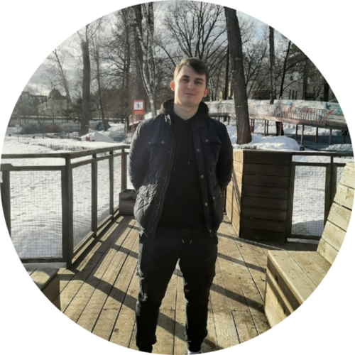

<h1> Березнюк Андрей Евгеньевич</h1>

<h2>Общая информация:</h2>

  

    
<b>Дата рождения</b>: 6 июля 1997 года;

    

      <b>Контактная информация</b>:
      <ul>
        <li>+7 (925) 1123856 — Для WhatsApp;</li>
        <li><b>+374 (91) 629311 — Для звонков</b>;</li>
        <li>fox.cpp@yandex.ru.</li>
      </ul>
    

    
<b>Город проживания</b>: Ереван, Республика Армения;

    
<b>Гражданство</b>: Российская Федерация;
 
    
<b>Желаемая должность</b>: Руководитель учебного отдела / Старший методист (от 110 000 руб.);

    
<b>Специализации</b>: методист, руководитель проектов, учитель/преподаватель/педагог, руководитель отдела персонала;

    
<b>Занятость</b>: полная занятость, частичная занятость, проектная работа;

    
<b>График работы</b>: полный день, сменный график, гибкий график, удаленная работа.

  

  

 

<h2>Опыт работы:</h2>

  
<b>Старший педагогический дизайнер видеопродакшена</b>, <a href="netology-group.ru/">центр онлайн-обучения Нетология-групп</a>. <i>(Апрель 2022 - по настоящее время)</i>
 
  <ol>
    <li>Планирование и контроль разработки и съемки образовательного контента;</li> 
    <li>Планирование и распределение бюджета;</li>
    <li>Координация и организация рабочего процесса команды;</li>
    <li>Автоматизация и оптимизация рабочих процессов;</li>
    <li>Организация взаимодействия команды с другими участниками производственного процесса;</li>
    <li>Разработка образовательной траектории;</li>
    <li>Разработка заданий разного формата согласно методическим целям по курсам;</li>
    <li>Планирование и организация съемок курса, контроль монтажа;</li>
    <li>Внедрение продукта и его поддержка;</li>
    <li>Анализ метрик и мониторинг состояния курса.</li>
  </ol>

  
<b>Преподаватель программирования</b>,  <a href="www.bytenbit.ru/">Byte'n'bit</a>. <i>(Август 2021 — по настоящее время)</i>

  <ol>
    <li>Проведение онлайн-занятий для учащихся 6-10 классов;</li>
    <li>Проведение открытых уроков для учащихся 6-10 классов и их родителей;</li>
    <li>Контроль знаний учеников;</li>
    <li>Коммуникация с учащимися и их родителями в оффлайн и онлайн форматах.</li>
  </ol>

  
<b>Продюсер образовательных курсов</b>,  <a href=www.bytenbit.ru/>Byte'n'bit</a>. <i>(Июнь 2021 — Сентябрь 2022)</i>

  <ol>
    <li>Исследование целевой аудитории, анализ конкурентов;</li>
    <li>Формирование перечня ожидаемых результатов обучения по образовательным программам;</li>
    <li>Проектирование программы курса вместе с экспертами;</li>
    <li>Организация/контроль/консультация испольнителей в процессе разработки материалов и съемок образовательного контента;</li>
    <li>Помощь в написании текстов для представления курсов аудитории.</li>
  </ol>

  
<b>Педагогический дизайнер (методист)</b>,  <a href=netology-group.ru/>центр онлайн-обучения Нетология-групп</a>. <i>(Март 2021 — Апрель 2022)</i>

  <ol>
    <li>Разработка образовательной траектории;</li>
    <li>Разработка заданий разного формата согласно методическим целям по курсам;</li>
    <li>Планирование и организация съемок курса, контроль монтажа;</li>
    <li>Внедрение продукта и его поддержка;</li>
    <li>Анализ метрик и мониторинг состояния курса.</li>
  </ol>

  
<b>Преподаватель программирования</b>,  <a href=code-class.ru/>школа программирования КодКласс</a>. <i>(Август 2019 — Июнь 2021)</i>

  <ol>
    <li>Проведение занятий для учащихся 1-9 классов по Scratch / Stencyl / AppInventor / Python / Java / Unity C# / WEB / Blender / С++ / UE4;</li>
    <li>Проведение открытых уроков для учащихся 1-9 классов и их родителей;</li>
    <li>Ответственность за компьютерный класс;</li>
    <li>Помощь в техническом обеспечении спец.уроков;</li>
    <li>Контроль знаний учеников;</li>
    <li>Коммуникация с учащимися и их родителями в оффлайн и онлайн форматах.</li>
  </ol>

  
<b>Автор курса по Scratch/AppInventor</b>,  <a href=technoschool.club/>Техношкола</a>. <i>(Сентябрь 2020 — Январь 2021)</i>

  <ol>
    <li>Разработка плана занятий курса;</li>
    <li>Создание презентаций и их последующее оформление;</li>
    <li>Разработка учебных материалов.</li>
  </ol>

  
<b>Автор курса по базовой компьютерной грамотности</b>,  <a href=skillfactory.ru/>ООО «Скилфэктори»</a>. <i>(Октябрь 2020 — Ноябрь 2020)</i>

  <ol>
    <li>Создание презентаций и их последующее оформление;</li>
    <li>Создание сценариев видеороликов;</li>
    <li>Запись занятий по выполненным презентациям.</li>
  </ol>

  
<b>HR менеджер</b>,  <a href=code-class.ru/>школа программирования КодКласс</a>. <i>(Февраль 2020 — Сентябрь 2020)</i>

  <ol>
    <li>Осуществление подбора преподавателей программирования;</li>
    <li>Осуществление обучения/дообучения преподавателей программирования;</li>
    <li>Разработка учебно-методических материалов (системы) для обучения преподавателей;</li>
    <li>Обучение руководителей филиалов данной сети школ программирования;</li>
    <li>Разрешение конфликтных ситуаций среди преподавателей и руководителей филиалов;</li>
    <li>Проведение симуляций с кандидатами в преподаватели.</li>
  </ol>

  
<b>Репетитор по математике/информатике</b>. <i>(Сентябрь 2016 — Май 2019)</i>

  <ol>
    <li>Проведение занятий для учащихся 6-9 классов.</li>
  </ol>

  
<b>Помощник инженера</b>,  <a href=www.s-telematics.ru/>ООО "Сервис-Телематика"</a>. <i>(Октябрь 2016 — Декабрь 2018)</i>

  <ol>
    <li>Выполнение правок по чертежам технологических изделий;</li>
    <li>Создание/доработка технической документации.</li>
  </ol>

 

<h2>Дополнительная информация:</h2>
<b>Образование</b>: Высшее, Московский государственный технический университет радиотехники, электроники и автоматики, Москва 2021,
Институт "Комплексной безопасности и специального приборостроения", Информационная безопасность телекоммуникационных сетей и систем связи;  
<b>Знание языков</b>: Русский — Родной, Английский — B2 — Средне-продвинутый;  
<b>Навыки</b>: обучаемость, пользователь ПК, грамотная речь, ведение переговоров, организаторские навыки, работа в команде, деловая переписка/общение, работа с большим объемом информации, грамотность, подготовка и проведение презентаций, подбор и обучение персонала, MS Office, Adobe Photoshop, Adobe Illustrator, Adobe Premiere Pro, Python 3, C++, Java, Веб-программирование;  
<b>Опыт вождения</b>: Права категории B.  

 

<h2>Обо мне:</h2>
<blockquote>
  
Я достаточно коммуникабельный человек, очень ответственный и дисциплинированный. Внимательный и работоспособный. Также обладаю творческим подходом к делу и энтузиазмом.

</blockquote>
